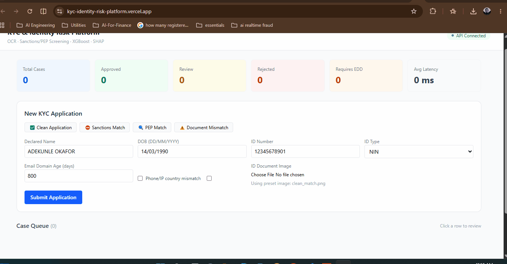

# kyc-identity-risk-platform

The companion platform to the [Real-Time Fraud Detection Pipeline](https://github.com/Mubrix2/ai-fraud-detection-pipeline).
Where Project 1 asks "is this transaction fraudulent?", this platform asks
"should we onboard this person, and at what risk tier?"

---

**Live Demo:** [kyc-identity-risk-platform.vercel.app](https://kyc-identity-risk-platform.vercel.app/)

**API Docs:** [kyc-identity-risk-platform.onrender.com/docs](https://kyc-identity-risk-platform.onrender.com/)

---



---

## The Pipeline

Application submitted (form + ID document image)
│
▼
Pydantic v2 validation (extra='forbid')
│
▼
OCR Extraction (Tesseract)
→ extracts name, DOB, ID number from document
│
▼
Field Cross-Validation (RapidFuzz)
→ declared vs extracted comparison
│
▼
Hard Rule: Sanctions Match
→ REJECT immediately (skip ML)
│
▼
PEP Screening
→ flag for Enhanced Due Diligence
│
▼
Risk Feature Engineering (10 features)
│
▼
XGBoost Risk Model
→ risk_probability (0–1)
│
▼
Decision Rules
(Rules consume ML output, can only escalate)
│
▼
3-Tier Decision
→ APPROVE / REVIEW / REJECT
│
▼
SHAP Explanation
(exact TreeExplainer attributions)
│
▼
PostgreSQL Audit Log
(append-only, immutable)
│
▼
Kafka
(kyc-events → kyc-results)
— additive, not required for scoring
│
▼
React Compliance Reviewer Dashboard

---

## Architecture
Browser → nginx :80

├── serves React static files

└── /api/* → api:8000 (internal Docker DNS)
FastAPI Process:

├── Main thread: HTTP endpoints

└── Consumer thread (daemon): Kafka kyc-events polling
PostgreSQL: kyc_audit table (append-only)

Kafka: kyc-events / kyc-results topics (local only)

---

## Rules vs ML Design

This system follows the production-standard "hard rules first" architecture:

1. **Hard rules BEFORE ML** — Sanctions match detected → immediate REJECT.
   No ML inference runs. This mirrors production fintechs where
   deterministic compliance requirements are never ML problems.

2. **Decision rules AFTER ML** — Rules consume the model's risk_probability.
   PEP match + low ML score → escalates to REVIEW minimum.
   Confirmed sanctions match + any ML score → REJECT.

3. **Rules only escalate, never de-escalate** — No combination of rules
   can turn a REJECT into an APPROVE.

---

## Tech Stack

| Layer | Technology | Purpose |
|---|---|---|
| OCR | Tesseract (pytesseract) | Document field extraction |
| Fuzzy Matching | RapidFuzz | Name similarity vs sanctions/fields |
| Sanctions Data | OFAC SDN List (real, 7,469 entries) | Sanctions screening |
| Risk Model | XGBoost + SHAP TreeExplainer | Risk scoring + explainability |
| Streaming | Apache Kafka 4.0.0 (KRaft) | Event-driven KYC workflow |
| Database | PostgreSQL 16 + SQLAlchemy 2.0 + psycopg3 | Audit trail |
| Backend | FastAPI + Pydantic v2 | Validated API |
| Frontend | React + Vite + Tailwind + Recharts | Reviewer dashboard |

---

## Running Locally

### Prerequisites

- Python 3.12.3 (`python --version`)
- Node.js 20+ (`node --version`)
- Docker Desktop or Docker Engine
- Kafka 4.x in WSL2 (`kafka-topics.sh --version`)
- Tesseract OCR (`tesseract --version` — install with `sudo apt-get install -y tesseract-ocr`)

### One-Time Setup

```bash
# Clone
git clone https://github.com/Mubrix2/kyc-identity-risk-platform.git
cd kyc-identity-risk-platform

# Python environment
python3 -m venv venv-linux
source venv-linux/bin/activate
pip install -r requirements.txt

# Environment
cp .env.example .env
# Open .env — update POSTGRES_PASSWORD to match your Docker Postgres

# Data
python scripts/download_sanctions_data.py
python scripts/generate_illustrative_pep_list.py
python scripts/generate_sample_id_images.py
python scripts/generate_synthetic_kyc_data.py --n 50000

# Model
python scripts/train_risk_model.py

# Sample images for dashboard presets
mkdir -p frontend/public/sample_ids
cp data/sample_ids/*.png frontend/public/sample_ids/

# Frontend dependencies
cd frontend && npm install && cd ..
```

### Starting the System (4 terminals)

```bash
# Terminal 1 — PostgreSQL
docker start kyc-postgres
# Verify: docker ps --filter name=kyc-postgres

# Terminal 2 — Kafka
kafka-server-start.sh ~/kafka/config/kraft/server.properties

# Terminal 3 — API
source venv-linux/bin/activate
uvicorn app.main:app --reload --port 8000
# Watch for:
# ✅ PostgreSQL tables ready
# ✅ Screening lists loaded
# ✅ Risk model loaded
# 🚀 KYC Platform ready

# Terminal 4 — Dashboard
cd frontend && npm run dev
# Open: http://localhost:5174
```

### Docker Compose (Alternative)

```bash
docker compose up --build
# API + Dashboard: http://localhost:80
# API Docs:        http://localhost:8000/docs
```

---

## Demo Test Cases

Use the dashboard preset buttons to test each decision path:

| Preset | Declared Name | Expected | Why |
|---|---|---|---|
| ✅ Clean Application | ADEKUNLE OKAFOR | APPROVE | Clean features, no sanctions match |
| ⛔ Sanctions Match | ABBAS, ABU | REJECT | Real OFAC SDN entry (SDGT program) |
| 🔍 PEP Match | ADEBAYO JOHNSON | REVIEW | Illustrative PEP list match — EDD required |
| ⚠️ Document Mismatch | BENJAMIN ADEWALE | REVIEW | Declared name won't match OCR extraction |

---

## API Reference

| Method | Endpoint | Description |
|---|---|---|
| `POST` | `/api/v1/kyc/submit` | Submit KYC application (multipart) |
| `GET` | `/api/v1/kyc/cases/{id}` | Get single case result |
| `GET` | `/api/v1/kyc/cases` | List all cases |
| `GET` | `/api/v1/kyc/stats` | Dashboard statistics |
| `POST` | `/api/v1/kyc/override` | Reviewer decision override |
| `GET` | `/health` | Health check |

**Submit example (curl):**
```bash
curl -X POST http://localhost:8000/api/v1/kyc/submit \
  -F "declared_name=ADEKUNLE OKAFOR" \
  -F "declared_dob=14/03/1990" \
  -F "declared_id_number=12345678901" \
  -F "declared_id_type=NIN" \
  -F "email_domain_age_days=800" \
  -F "device_fingerprint=device-test-001" \
  -F "document=@data/sample_ids/clean_match.png"
```

---

## Decision Logic

```python
# Hard rules run before ML — fast short-circuit for compliance absolutes
if sanctions_match:
    REJECT  # deterministic, not a model problem

# ML scoring
risk_probability = xgboost_model.predict(features)

# Decision rules consume ML output
if risk_probability >= 0.80: REJECT
elif risk_probability >= 0.45 or pep_match: REVIEW
else: APPROVE
```

---

## Project Structure
app/core/               ML + screening + validation modules

app/services/           Orchestrator (pipeline coordination)

app/streaming/          Kafka producer + consumer thread

app/db/                 SQLAlchemy models + PostgreSQL session

app/api/routes/         FastAPI endpoints

data/sanctions/         OFAC SDN list + illustrative PEP list

data/sample_ids/        Fictional ID card images (OCR test data)

frontend/public/        Static assets (sample images for dashboard)

scripts/                Data generation + training scripts

tests/                  Unit + integration tests

---

## Common Setup Issues

- **`python-multipart` not installed** — `pip install python-multipart`
  (required for file upload endpoints, not obvious from FastAPI's error)
- **Postgres password mismatch** — password is only set on first volume
  initialization. If recreating the container, wipe the volume first:
  `docker rm -f kyc-postgres && docker volume rm <volume>`
- **Everything REJECT** — confirm sample images are in `frontend/public/sample_ids/`
  and Tesseract can read them: `python -c "from app.core.ocr_engine import process_document; print(process_document('data/sample_ids/clean_match.png'))"`
- **Port 5432 already in use** — another Postgres instance is running:
  `sudo lsof -i :5432` to identify and stop it

---

## Scaling Roadmap

**Stage 1 (1K–50K verifications/day):** Redis for onboarding velocity state
(replace in-memory dict), rate limiting at nginx gateway.

**Stage 2 (50K–1M):** Licensed PEP database (Refinitiv World-Check /
ComplyAdvantage), OCR upgrade to managed service (AWS Textract / Google
Vision) for higher accuracy, PostgreSQL connection pooling (PgBouncer).

**Stage 3 (1M+):** Liveness detection for face verification module,
adverse media screening, multi-broker Kafka with replication factor 3.

The core pipeline — OCR, screening, feature engineering, risk scoring,
rules, decisions, audit — scales without modification.

---

## Regulatory Context

- **FATF Recommendation 10 (CDD):** Verify identity before onboarding
- **FATF Recommendation 12 (PEPs):** Enhanced Due Diligence required
- **OFAC SDN Screening:** Required for USD-corridor fintechs
- **NDPR / GDPR Article 22:** Automated decisions must be explainable
  (satisfied by SHAP) and auditable (satisfied by PostgreSQL log)
- **CBN KYC Regulations:** Identity verification required by Nigerian CBN

---

## Author

**Mubarak Olalekan Oladipo** — AI Engineer, Fraud & Risk Management
[GitHub](https://github.com/Mubrix2) · [LinkedIn](https://www.linkedin.com/in/mubarak-oladipo/)

Companion project: [Real-Time Fraud Detection Pipeline](https://github.com/Mubrix2/ai-fraud-detection-pipeline)
